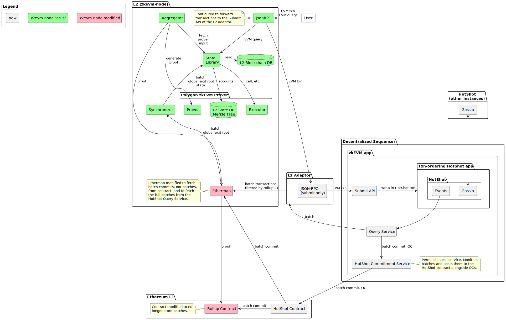

# Espresso Sequencer - Polygon zkEVM - Integration Demo

This repo contains a demo where two rollups based on the Polygon zkEVM stack use the Espresso Sequencer
and Data Availability (DA) instead of the Polygon zkEVM Sequencer and Ethereum
L1 as DA.

The repo consists mainly of rust code, docker services and end-to-end tests
to tie together the following code bases:

- The [Espresso Sequencer](
https://github.com/EspressoSystems/espresso-sequencer).
- A fork of Polygon's
[zkevm-node](https://github.com/0xPolygonHermez/zkevm-node) used as submodule at
[./zkevm-node](zkevm-node).
- A fork of Polygon's
[zkevm-contracts](https://github.com/0xPolygonHermez/zkevm-contracts) used as
submodule at [./zkevm-contracts](zkevm-contracts).

The diagram below shows the architecture. Note that only one of the zkEVM nodes
is depicted for simplicity. The diagram is intended to give a simple conceptual
overview, there may be slight discrepancies in how individual components are
depicted and implemented.



# Usage

- To get the latest images: `just pull`
- To start the demo: `just demo`.
- To stop the demo: `just down`

## Metamask
- If not yet set up, install [Metamask](https://metamask.io/) and set up a new
  wallet.
- In metamask click on the three dots in the top right corner, then "Expand view".
- On the newly opened page click on the three dots in the top right corner, then
  "Networks" -> "Add a network" -> "Add a network manually".

Use the following parameters:

- Network name: espresso-polygon-zkevm-1
- New RPC URL: http://localhost:18126
- Chain ID: 1001

For interacting with the second rollup add a network with these parameters instead:

- Network name: espresso-polygon-zkevm-2
- New RPC URL: http://localhost:28126
- Chain ID: 1002

For "Currency symbol" anything can be set and "Block explorer URL" should be
left blank.

## Faucet
To request funds from the local faucet run

```
curl -X POST http://localhost:18111/faucet/request/0x0000000000000000000000000000000000000000
```

replacing the zero address with the desired receiver address. Use
http://localhost:28111 to talk to the faucet of the second node instead.

To copy your Metamask address click on the address at the top of the Metamask panel.

# Development

- Obtain code: `git clone --recursive git@github.com:EspressoSystems/espresso-polygon-zkevm-demo`.
- Make sure [nix](https://nixos.org/download.html) is installed.
- Activate the environment with `nix-shell`, or `nix develop`, or `direnv allow`
  if using [direnv](https://direnv.net/).
- Run `just` to see the available just recipes.

To know more about the environment check out the following files

- [.env](.env): Environment variables
- [docker-compose.yaml](docker-compose.yaml): Espresso Sequencer services
- [permissionless-docker-compose.yaml](permissionless-docker-compose.yaml): Polygon zkEVM services

Another good place to start is the end-to-end test in [polygon-zkevm-adaptor/tests/end_to_end.rs](polygon-zkevm-adaptor/tests/end_to_end.rs).

## Test
To run the tests, run

    just pull # to pull docker images
    cargo test --all-features

## Figures
To build the figures, run

    make doc

## Contracts

- Ensure submodules are checkout out: `git submodule update --init --recursive`
- Install dependencies `just npm i`
- Compile the contracts `just hardhat compile`
- Update the rust bindings: `just update-contract-bindings`
- Update the zkevm-node contract bindings to match zkevm-contracts: `just
update-zkevm-node-contract-bindings`

### Misc
#### Building docker images locally
- Build the docker images locally: `just build-docker`.
- Revert to the CI docker images: `just pull`.

#### Authenticate with GitHub container registry
This is only required to download "private" docker images from the GitHub container registry.

- Go to your github profile
- Developer Settings > Personal access tokens > Personal access tokens (classic)
- Generate a new token
  - for the scope options of the token, tick the _repo_ box.
- Run `docker login ghcr.io --username <you_github_id> --password <your_personal_access_token>`

#### Handling git submodules

The project requires to use git submodules. In order to avoid corrupting the
state of one of those submodules you can:

- run `git submodule update` before making changes,
- or configure git to automatically update submodules for the repository with
  `git config submodule.recurse true` inside the repository.
